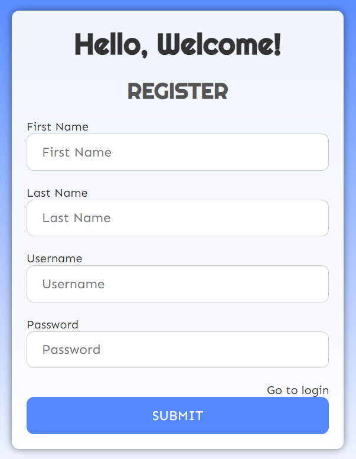

# Todo
<i>CST8319 Software Development Project</i>

This is a Todo application built with Java, Spring Boot, and MySQL. The application allows users to create, read, update, and delete tasks.

## Features

- User authentication
- Create, Read, Update, Delete (CRUD) tasks
- Persistent storage using MySQL

## Technologies Used

- **Java**: Programming language used to build the application.
- **Spring Boot**: Framework for building RESTful applications.
- **MySQL**: Relational database management system for storing tasks.

